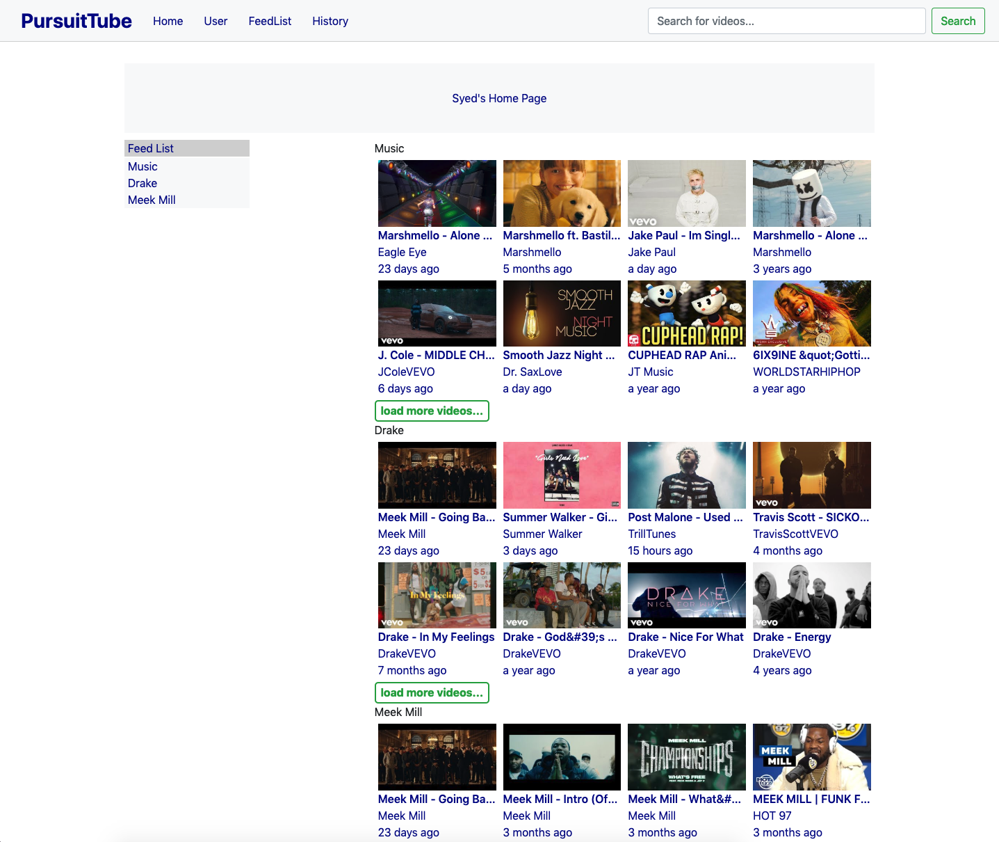
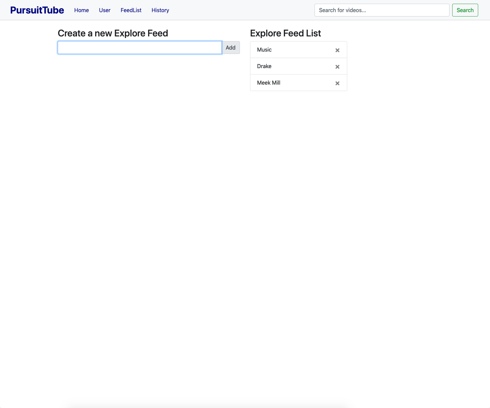
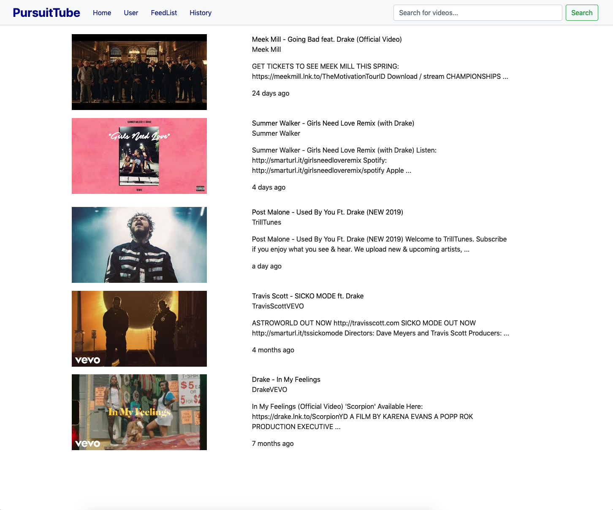
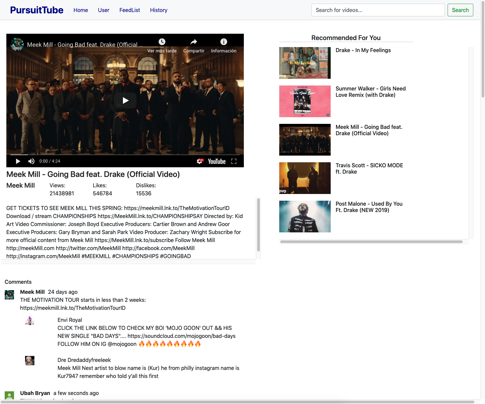
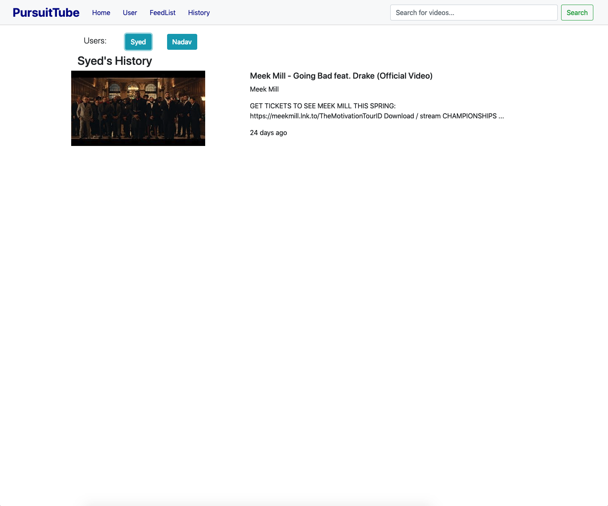
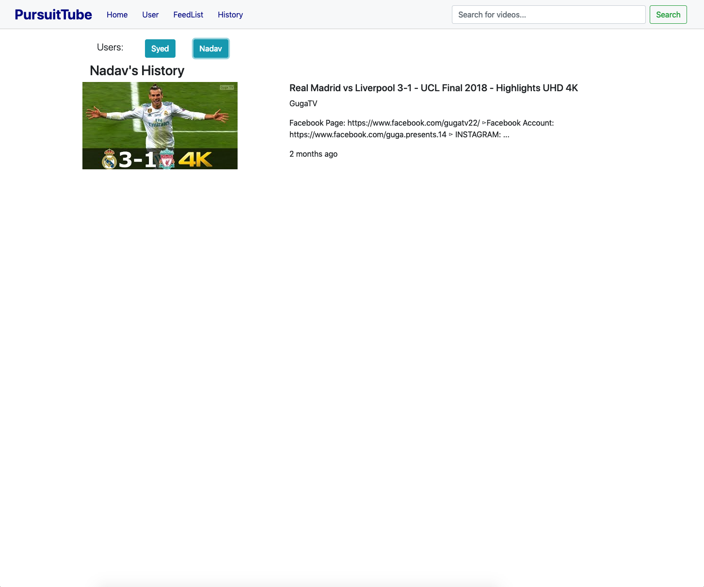

# PursuitTube

Video app that emulates basic **YouTube** functionality, based on **YouTube API**. Built using **JavaScript**, **HTML**, **CSS**. Also saves the current state of the app by implementantion of the browser's Local Storage.

## Contributors
>* **Team Lead** / **Developer**: [Syed Aziz](https://github.com/syedaziz27)
>* **Developer**: [Tarek Islam](https://github.com/tarekul)
>* **Developer**: [Nadav Green](https://github.com/nadavgreen)
>* **Developer**: [Jose Rodriguez](https://github.com/JayRodrig)

## Libraries Used
> * **ReactJS**
> * **BootStrap**
> * **Axios**

## Screenshots
* **Home Page:**
	
	
* **User Page:**
	

* **Feed Page:**
	
	
* **Search Page:**
	
	
* **Video Page:**
	

* **History Page:**
	
	
	
